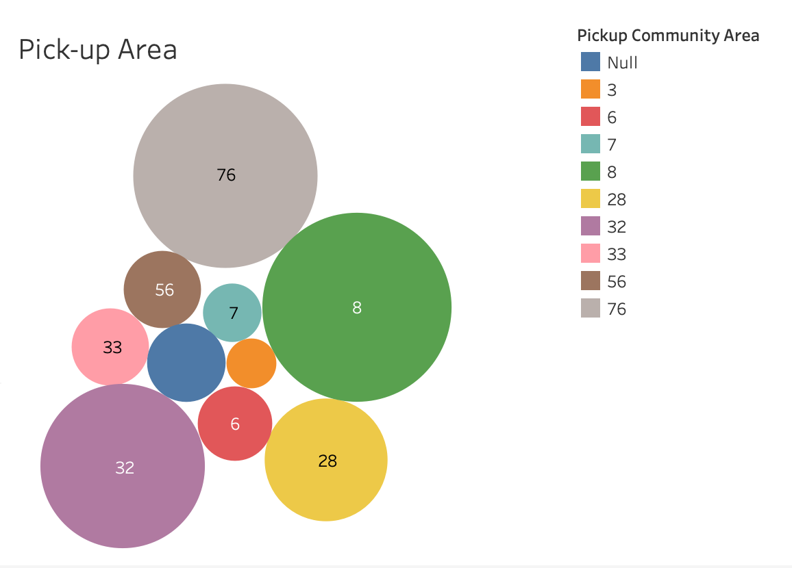

# chicago-taxi-analysis

# 🚕 Chicago Taxi & Ride-Share Trip Analysis (BigQuery + Tableau)

This project analyzes taxi and ride-share trends in Chicago using public data from [Google BigQuery](https://console.cloud.google.com/bigquery). The results are visualized using Tableau, showcasing trends in ride volume, company usage, payment methods, and geographic demand.

---

## 📌 Project Summary

- **Data Source**: `bigquery-public-data.chicago_taxi_trips.taxi_trips`
- **Tools Used**: Google BigQuery (SQL), Tableau (Visualization)
- **Time Period Analyzed**: Jan 2023 – Dec 2023

---

## 📊 Key Analyses & Charts

### 1. Monthly Ride Volume Trend
> Query: [`sql/monthly.sql`](sql/month.sql)

---

### 2. Top Companies by Ride Count
> Query: [`sql/company.sql`](sql/company.sql)

---

### 3. Distribution of Payment Types
> Query: [`sql/payment.sql`](sql/payment.sql)

---

### 4. Top 10 Pickup Areas
> Query: [`sql/pickup.sql`](sql/pickup.sql)

---

## 🧠 Skills Demonstrated

- BigQuery SQL (aggregation, filtering, date formatting)
- Tableau visualization (pie chart, bar chart, line chart)
- Public dataset analysis
- Exploratory data analysis (EDA)

---

## 📁 Data

All raw query results are saved as CSVs in the [`data/`](data/) folder. You can re-create the analysis using the provided SQL queries.

---

## 📌 Next Steps

- Add geospatial mapping of pickup areas
- Compare trends across multiple years
- Build interactive Tableau Dashboard

---

## 📬 Contact

Made by Siming Liu.  
Feel free to reach out!
